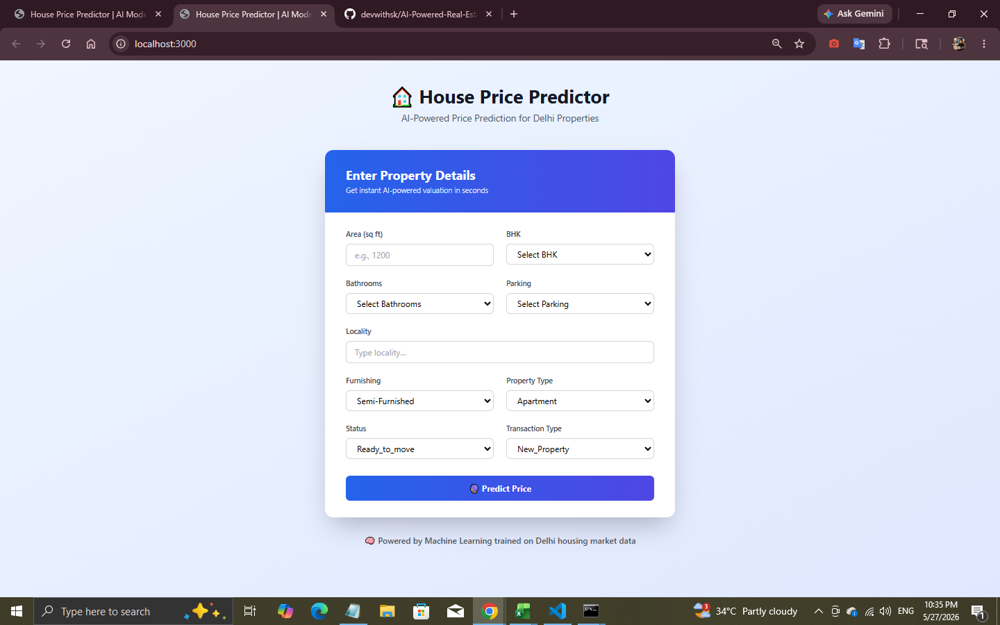
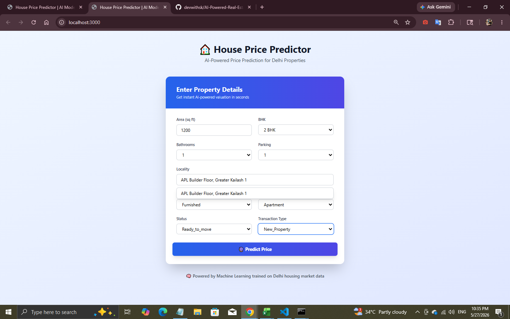
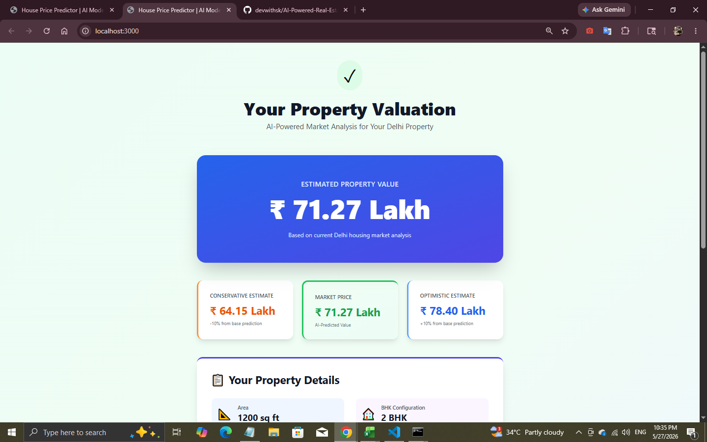
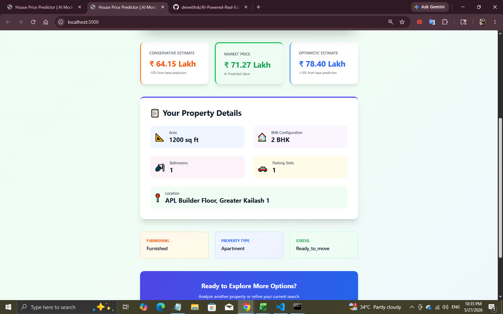

# 🏠 House Price Prediction - AI Model

A complete full-stack application for predicting house prices in Delhi using Machine Learning. Beautiful React frontend + Flask backend with live price predictions!

## ✨ Features

- 🎯 **Real-time Price Predictions** - Get instant house price estimates
- 🎨 **Professional UI** - Beautiful, responsive design with Tailwind CSS
- 🧠 **AI-Powered** - Linear Regression model trained on Delhi housing data
- 🔐 **Secure API** - Flask backend with CORS support
- 📱 **Fully Responsive** - Works on desktop, tablet, and mobile
- ⚡ **Fast & Efficient** - Optimized predictions with preprocessing

## 📊 What You Can Predict

The model predicts house prices based on:
- **Area** (in sq ft)
- **BHK** (1-6 bedrooms)
- **Bathrooms** (1-5)
- **Parking** spaces (0-4)
- **Locality** (12+ Delhi localities)
- **Furnishing** (Unfurnished, Semi-Furnished, Furnished)
- **Property Type** (Apartment, Independent House, Villa)
- **Status** (Ready to move, Under Construction)
- **Transaction Type** (New Property, Resale)

## Screenshots

### Home Page



### Prediction Page



## 🛠️ Step-by-Step Setup Guide

We have made the installation process as simple as possible. Just follow these steps:

### Download the Project
Make sure you have **Python 3.10 or higher** installed on your computer. 
Clone this repository or download it as a ZIP file and extract it.

```bash
git clone https://github.com/devwithsk/AI-Powered-Real-Estate-Predictions.git
cd AI-Powered-Real-Estate-Predictions
```

## 🚀 Quick Start

### Option 1: One-Command Setup (Recommended)

**Windows:**
```bash
cd "e:\AI Projects\house-price-prediction"
run.bat
```

**Linux/Mac:**
```bash
cd ~/path/to/house-price-prediction
chmod +x run.sh
./run.sh
```

### Option 2: Manual Setup

**Backend:**
```bash
cd backend
pip install -r requirements.txt
python app.py
```
Backend runs on: `http://localhost:5000`

**Frontend (in a new terminal):**
```bash
cd frontend
npm install
npm start
```
Frontend runs on: `http://localhost:3000`

## 📁 Project Structure

```
house-price-prediction/
├── backend/
│   ├── app.py                 # Flask API server
│   ├── model.pkl              # Trained ML model
│   ├── requirements.txt        # Python dependencies
│   └── .gitignore
├── frontend/
│   ├── public/
│   │   └── index.html         # HTML template
│   ├── src/
│   │   ├── App.jsx            # Main component
│   │   ├── App.css            # Component styles
│   │   ├── index.jsx          # React entry point
│   │   └── index.css          # Global styles
│   ├── package.json           # Node dependencies
│   ├── tailwind.config.js     # Tailwind config
│   ├── postcss.config.js      # PostCSS config
│   ├── tsconfig.json          # TypeScript config
│   └── .gitignore
├── Delhi_house_data.csv       # Training dataset
├── main.py                    # Model training script
├── run.bat                    # Windows startup script
├── run.sh                     # Linux/Mac startup script
├── SETUP.md                   # Detailed setup guide
└── README.md                  # This file
```

## 🔧 API Endpoints

### Get Available Options
```http
GET /api/options
```
Returns all available dropdown values (localities, furnishing types, etc.)

### Make a Prediction
```http
POST /api/predict
Content-Type: application/json

{
  "area": 1200,
  "bhk": 3,
  "bathroom": 2,
  "furnishing": "Semi-Furnished",
  "locality": "Rohini Sector 24",
  "parking": 1,
  "status": "Ready_to_move",
  "transaction": "New_Property",
  "property_type": "Apartment"
}
```

**Response:**
```json
{
  "success": true,
  "predicted_price": 7500000.50,
  "currency": "₹",
  "message": "Predicted house price: ₹ 7,500,000.50"
}
```

## 💻 Tech Stack

### Frontend
- **React 18** - UI library
- **Axios** - HTTP client
- **Tailwind CSS** - Utility-first CSS framework
- **React Scripts** - Build tooling

### Backend
- **Flask** - Web framework
- **Flask-CORS** - Cross-origin request handler
- **Scikit-learn** - ML library
- **Pandas** - Data manipulation
- **NumPy** - Numerical computing
- **Joblib** - Model serialization

## 📈 Model Details

- **Algorithm:** Multiple Linear Regression
- **Training Data:** Delhi housing data (1000+ properties)
- **Features:** 10 input features after preprocessing
- **Preprocessing:** OneHotEncoder for categorical variables
- **Performance:** Trained and evaluated on 80-20 train-test split

## 🎨 UI/UX Highlights

- Clean gradient backgrounds
- Smooth animations and transitions
- Form validation and error handling
- Loading states for API calls
- Formatted currency display (₹)
- Mobile-responsive layout
- Professional card-based design

## 🐛 Troubleshooting

**Port already in use?**
```bash
# Kill process on port 5000 (backend)
netstat -ano | findstr :5000
taskkill /PID <PID> /F

# Kill process on port 3000 (frontend)
netstat -ano | findstr :3000
taskkill /PID <PID> /F
```

**Dependencies issues?**
```bash
# Backend
cd backend
pip install --upgrade -r requirements.txt

# Frontend
cd frontend
npm cache clean --force
rm -rf node_modules package-lock.json
npm install
```

**Model not loading?**
- Make sure `model.pkl` exists in `backend/` folder
- Check that the file hasn't been moved or deleted

## 📝 Example Predictions

**Luxury Apartment:**
- Area: 2500 sq ft
- BHK: 4
- Bathrooms: 3
- Locality: Connaught Place
- Furnishing: Furnished
- Parking: 2
- Status: Ready to move
- Type: Apartment
- Result: ~₹ 5,50,00,000

## 🔐 Security Notes

- CORS is enabled for development
- Input validation on both frontend and backend
- No sensitive data is stored
- All predictions are calculated server-side

## 📚 Useful Commands

```bash
# Install backend dependencies
pip install -r backend/requirements.txt

# Install frontend dependencies
npm install --prefix frontend

# Run backend only
cd backend && python app.py

# Run frontend only
cd frontend && npm start

# Build frontend for production
cd frontend && npm run build

# Check if ports are in use
netstat -ano | findstr :5000
netstat -ano | findstr :3000
```

## 🤝 Contributing

Feel free to modify and improve:
- Add more features
- Improve model accuracy
- Enhance UI/UX
- Add more localities
- Implement authentication

## 📄 License

This project is free to use and modify.

## 🎯 Next Steps

1. ✅ Run the application using `run.bat` or `run.sh`
2. Open `http://localhost:3000` in your browser
3. Fill in the property details
4. Click "Predict Price"
5. Get your estimated house price! 🎉

---

Made with ❤️ | AI-Powered Real Estate Predictions

---

# 🚀 Final Thoughts

This project is more than just a Machine Learning model — it represents the vision of building intelligent real-world solutions using AI, data, and modern development technologies.

From data preprocessing to prediction and frontend integration, every part of this project was built with the goal of creating something practical, scalable, and impactful.

If this project helped you, inspired you, or gave you ideas for your own AI journey, consider giving it a ⭐ on GitHub. Your support motivates continuous innovation and improvement.

## 💡 Future Improvements
- Advanced ML Models
- Real-Time Market Data Integration
- Interactive Analytics Dashboard
- AI-Based Recommendation System
- Cloud Deployment & API Scaling

---

## 👨‍💻 Developed By

**Sonu Kumar**  
Passionate about AI, Machine Learning, Automation, and building real-world intelligent systems.

### 🌐 Connect With Me
- GitHub: https://github.com/devwithsk
- LinkedIn: www.linkedin.com/in/devwithsk

---

# ⭐ “Turning Data Into Intelligent Decisions.”

🚀 Happy Coding & Keep Building Amazing Things!


